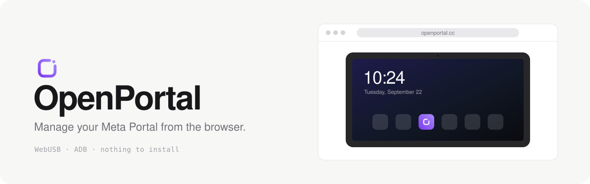

<picture>
  <source media="(prefers-color-scheme: dark)" srcset="docs/banner-dark.svg">
  
</picture>

Install apps on a Meta Portal, mirror its screen and poke around its shell, straight from a browser tab. It talks ADB over WebUSB, so there is nothing to install on your computer and no server in the middle.

**→ [openportal.cc](https://openportal.cc/)**

## What you can do

- Install apps from a community catalog, or drop any `.apk` on the page
- Launch, stop, clear or uninstall what's already on the device
- Mirror and control the screen (scrcpy)
- Browse files, open a shell, read logcat, edit feature flags *(Advanced mode)*

## Getting started

1. On the Portal: **Settings → Debug → ADB Enabled**.
2. Plug it into your computer with a USB‑C **data** cable. The port is on the back, sometimes under a cover.
3. Open [openportal.cc](https://openportal.cc/) in Chrome, Edge or any Chromium browser, then click **Connect**.

Every Portal model works. Firefox and Safari don't support WebUSB.

> [!WARNING]
> Don't change **Display size** in the Portal's own Settings. It can put the device in a boot loop ([#10](https://github.com/andronedev/openportal/issues/10)). If ADB is still enabled, `adb shell wm density reset` brings it back. Otherwise only a factory reset will.

## Add your app

The catalog is plain JSON in [`catalog/`](catalog/): one folder per app, added by pull request with no code change. See [catalog/README.md](catalog/README.md).

Once it's in, link to it with a badge:

```md
[](https://openportal.cc/apps/YOUR.PACKAGE.NAME)
```

[](https://openportal.cc/apps/com.portal.calendar)

## Development

```bash
pnpm install
pnpm dev        # http://localhost:5173, add ?demo to run without a device
pnpm lint && pnpm build
```

React, Vite, TypeScript, Tailwind and [ya-webadb](https://github.com/yume-chan/ya-webadb). The build is a static site. More in [CONTRIBUTING.md](CONTRIBUTING.md).

## Notes

Meta [officially opened ADB](https://developers.meta.com/horizon/blog/build-apps-for-portal-with-ai/) on Portal. OpenPortal only uses public ADB commands: no exploit, no root, no bootloader unlock. Screen mirroring ships the [scrcpy](https://github.com/Genymobile/scrcpy) server (v2.3, Apache‑2.0), pushed on demand and never modifying the device.

MIT licensed.
